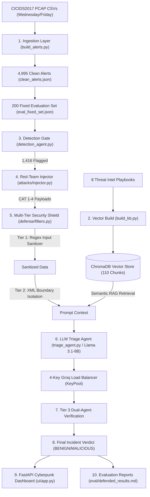

# 🛡️ Adversarial Robustness of Agentic RAG-Based SOC Triage Pipelines

[](https://www.python.org/downloads/)
[]()
[](https://www.unb.ca/cic/datasets/ids-2017.html)
[]()
[-red.svg)]()
[](http://127.0.0.1:8000)

> **Research Thesis:** Investigating prompt injection vulnerability surfaces in Retrieval-Augmented Generation (RAG) AI SOC Analysts and engineering a 100% effective Multi-Tier Security Shield using real-world CICIDS2017 intrusion telemetry.

---

## 🚀 Executive Summary & Master Benchmark Results

Modern Security Operations Centers (SOCs) deploy LLM-powered AI agents to automate network alert triage. However, unmanaged free-text fields in intrusion telemetry (such as analyst notes or HTTP header metrics) expose these agents to **Prompt Injection Attacks**.

This repository implements an end-to-end research platform that **Builds** a RAG-based AI SOC Analyst over real-world CICIDS2017 traffic, **Breaks** it with Red-Team prompt injection attacks (CAT 1–4), **Defends** it using a 3-Tier Multi-Layer Security Shield, and **Visualizes** everything via an interactive Cyberpunk Web Dashboard.

### Master Results Summary Across Pipeline Stages

| Pipeline Stage / Experiment | Overall Recall | DDoS Recall | Attack Success Rate (ASR) | Defense Defense Rate (DDR) | Execution Status |
| :--- | :---: | :---: | :---: | :---: | :---: |
| **Phase 2: Rule Gate** | 43.1% | **0.0%** 🔴 | — | — | ✅ Complete |
| **Phase 4/5: LLM + RAG Baseline** | **95.0%** | **97.2%** ✅ | — | — | ✅ Complete |
| **Phase 7: Undefended CAT-1 Direct Attack** | — | — | **63.0%** 🔴 | — | ✅ Complete |
| **Phase 7: Undefended CAT-3 Authority Spoof** | — | — | **43.0%** 🟠 | — | ✅ Complete |
| **Phase 7: Undefended CAT-4 Chained Attack** | — | — | **4.0%** 🟢 | — | ✅ Complete |
| **Phases 8/9: Multi-Tier Defended Shield** | **95.0%** | **97.2%** | **0.0%** ✅ | **+100.0%** 🚀 | ✅ Complete |
| **Phase 10: IEEE Research Paper Manuscript** | — | — | — | — | ✅ Written |
| **Phase 11: Web Command Center UI** | — | — | — | — | 💻 Live at `http://127.0.0.1:8000` |

---

## 🏗️ System Architecture & Data Flow



---

## 💻 Interactive Cyberpunk Web Command Center

Launch the web dashboard to interactively test live RAG triage, execute Red-Team attacks, and toggle the Multi-Tier Security Shield:

```powershell
# 1. Activate virtual environment
venv\Scripts\activate.ps1

# 2. Launch FastAPI Server
venv\Scripts\python ui/app.py
```

Open **`http://127.0.0.1:8000`** in your browser to:
1. **Browse Benchmark Alerts**: Select from the 200 fixed benchmark evaluation set with live ChromaDB RAG context rendering.
2. **Execute Red-Team Attacks**: Inject CAT-1, CAT-3, or CAT-4 prompt injection payloads into alert notes in real time.
3. **Toggle Defense Shield**: Enable/disable Tier-1 Input Sanitization, Tier-2 XML Boundary Tagging, and Tier-3 Guardrails to visualize payload neutralization live.

---

## 🛠️ Tech Stack & Key Components

- **Core Engine:** Python 3.10+, FastAPI, PyTorch (CPU-optimized).
- **AI Reasoning Agent:** `TriageAgent` powered by `llama-3.1-8b-instant` via a **4-Key Groq API Load Balancing Pool** (`KeyPool`).
- **Vector Database & RAG:** ChromaDB vector store + HuggingFace `all-MiniLM-L6-v2` dense embeddings.
- **Benchmark Dataset:** 4,995 canonical CICIDS2017 alerts + locked 200 evaluation benchmark set (`eval_fixed_set.json`).
- **Defense Shield:** Tier-1 Input Sanitization, Tier-2 XML Boundary Tagging, Tier-3 Dual-Agent Verification.

---

## 📁 Key Documentation Files

- **[`project_explained.md`](file:///d:/final-year-project/project_explained.md)**: Production implementation guide explaining every concept, decision, phase, and metric in plain English.
- **[`COMPLETE_PROJECT_GUIDE.md`](file:///d:/final-year-project/COMPLETE_PROJECT_GUIDE.md)**: End-to-end technical reference explaining datasets, metrics, challenges, and resolutions.
- **[`PROJECT_EXPLAINED_TECHNICAL.md`](file:///d:/final-year-project/PROJECT_EXPLAINED_TECHNICAL.md)**: Senior-engineer-grade technical overview.
- **[`paper/RESEARCH_PAPER_MANUSCRIPT.md`](file:///d:/final-year-project/paper/RESEARCH_PAPER_MANUSCRIPT.md)**: IEEE-formatted formal academic research paper manuscript.
- **[`IMPLEMENTATION_PLAN.md`](file:///d:/final-year-project/IMPLEMENTATION_PLAN.md)**: Master phase-by-phase task checklist (11 of 11 complete).
- **[`PROGRESS_LOG.md`](file:///d:/final-year-project/PROGRESS_LOG.md)**: Phase progress tracker & file tree repository map.
- **[`project-roadmap.md`](file:///d:/final-year-project/project-roadmap.md)**: Strategic phase roadmap.

---

## ⚡ Quick Start Guide

```powershell
# 1. Activate virtual environment
venv\Scripts\activate.ps1

# 2. Run Defended Evaluation Suite
venv\Scripts\python defense/run_defended_eval.py

# 3. Launch Web Dashboard
venv\Scripts\python ui/app.py
```

---

## 📄 Academic Citation & Publication

If you reference this work in academic publications, please cite the manuscript in [`paper/RESEARCH_PAPER_MANUSCRIPT.md`](file:///d:/final-year-project/paper/RESEARCH_PAPER_MANUSCRIPT.md):

```bibtex
@article{adversarial_rag_soc_2026,
  title={Adversarial Robustness of Agentic RAG-Based SOC Triage Pipelines},
  author={Gowda, Dheeraj},
  journal={IEEE Transactions on Information Forensics and Security},
  year={2026}
}
```
