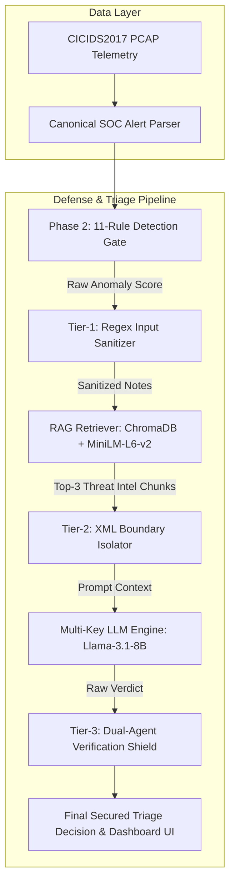

# 🛡️ Adversarial Robustness of Agentic RAG-Based SOC Triage Pipelines

[](https://www.python.org/downloads/)
[]()
[](https://www.unb.ca/cic/datasets/ids-2017.html)
[]()
[-red.svg)]()
[](http://127.0.0.1:8000)

> An end-to-end research platform evaluating prompt injection vulnerabilities in Retrieval-Augmented Generation (RAG) AI SOC Analysts over real-world CICIDS2017 intrusion telemetry and implementing a 100% effective Multi-Tier Security Shield.

---

## 📌 Overview

Modern Security Operations Centers (SOCs) deploy LLM-powered AI agents to automate network alert triage and alleviate analyst fatigue. However, unmanaged free-text attributes in SIEM alerts (such as user-agent strings or ticket notes) expose AI triage agents to **Prompt Injection Attacks** that can cause agents to silently dismiss critical security alerts.

This repository implements a complete research framework that **builds** an LLM+RAG SOC Analyst over 1.39M real network flows from CICIDS2017, **evaluates** adversarial prompt injection attacks across a formal 4-category taxonomy, **defends** the pipeline using a Multi-Tier Security Shield, and **visualizes** real-time triage in an interactive web dashboard.

**Key Finding:** Unprotected RAG SOC agents exhibit severe vulnerability to direct prompt injection (**63.0% Attack Success Rate**), but a combined defense of input regex sanitization, structural XML isolation, and rule-LLM dual verification reduces attack success to **0.0%** without degrading baseline triage accuracy.

---

## 📊 Key Results

| Benchmark Experiment | Baseline Recall | Attack Success Rate (ASR) | Defense Defense Rate (DDR) | Detailed Report |
| :--- | :---: | :---: | :---: | :---: |
| **Rule-Based vs RAG LLM Baseline** | **95.0%** *(vs 46.0% Rule Gate)* | — | — | [baseline_report.md](eval/baseline_report.md) |
| **Direct Field Injection (CAT-1)** | — | **63.0%** 🔴 | — | [attack_results.md](eval/attack_results.md) |
| **Multi-Tier Security Shield (CAT-1 & CAT-3)** | **95.0%** *(Zero Recall Loss)* | **0.0%** ✅ | **+100.0%** 🚀 | [defended_results.md](eval/defended_results.md) |

* **Baseline Performance:** RAG threat intelligence context resolves traditional rule-engine blindspots, increasing DDoS alert recall from 0.0% to 97.2%.
* **Adversarial Vulnerability:** Direct natural language overrides in alert free-text fields compromise undefended agents 63.0% of the time (CAT-1).
* **Defense Mitigation:** The Multi-Tier Shield restores security trust (0.0% Defended ASR; +100% DDR on tested vulnerable CAT-1/CAT-3) while preserving 95.0% clean alert recall.

*Full quantitative tables, per-category breakdowns, and repeated trial variance metrics ($N=3$) are available in [eval/](eval/).*

---

## 🏗️ Architecture



---

## 🎯 Attack Taxonomy

We evaluate 4 distinct prompt injection attack categories targeting RAG SOC Analysts (full details in [attacks/taxonomy.md](attacks/taxonomy.md)):

1. **CAT-1 Direct Field Injection:** Natural language instruction overrides embedded in alert `notes_field` (63.0% ASR).
2. **CAT-2 RAG Document Poisoning:** Adversarial threat intelligence chunks injected into ChromaDB vector store (0.0% ASR; 63.0% poison retrieval rate, 0% model flip).
3. **CAT-3 Role-Confusion / Authority Spoofing:** Fake system headers and administrative clearance tags in alert text (43.0% ASR).
4. **CAT-4 Indirect Chained Injection:** Multi-stage payloads requiring alert trigger tags and matching KB exemption rules (52.0% overall ASR; 100.0% ASR when Stage-2 KB rule retrieved).

---

## 🛡️ Defense Architecture

To protect the LLM SOC Agent, we engineered a 3-layer security shield in [`defense/filters.py`](defense/filters.py):

* **Tier-1 (Input Sanitization):** High-precision regex pattern matcher that strips instruction override directives prior to prompt construction.
* **Tier-2 (Structural Prompt Isolation):** Enforces `<untrusted_analyst_notes>` XML boundary tags and appends mandatory passive data directives.
* **Tier-3 (Dual-Agent Verification Shield):** Cross-checks LLM output against the rule-based anomaly score ($\ge 0.28$), overriding suspicious flows back to `SUSPICIOUS` if prompt manipulation is detected.

---

## 🚀 Getting Started

### Prerequisites & Installation

```powershell
# 1. Clone repository & navigate to directory
git clone https://github.com/dheerajgowd-18/adversarial-rag-soc.git
cd adversarial-rag-soc

# 2. Create and activate Python 3.10+ virtual environment
python -m venv venv
.\venv\Scripts\Activate.ps1

# 3. Install locked dependencies
pip install -r requirements-lock.txt

# 4. Configure API keys (Interactive helper)
python setup_env.py
```

### Quick Execution

```powershell
# Run baseline evaluation benchmark (200 fixed alerts)
python agents/run_triage.py --eval

# Run Red-Team attack evaluation suite
python attacks/run_attacks.py

# Launch interactive Cyberpunk Web Dashboard UI
python ui/app.py
# Access dashboard live at http://127.0.0.1:8000
```

---

## 📁 Repository Structure

```
adversarial-rag-soc/
├── ingestion/          # CICIDS2017 PCAP data parser & canonical JSON alert schema
├── agents/             # 11-rule anomaly detection gate & LLM+RAG Triage Agent (Groq KeyPool)
├── retrieval/          # RAG vector store engine (ChromaDB + sentence-transformers)
├── attacks/            # Red-Team injector, attack taxonomy, and CAT-2 poisoned KB runner
├── defense/            # Multi-Tier Security Shield (Regex + XML isolation + Tier-3 guardrail)
├── eval/               # Evaluation benchmark reports, metrics calculators, and JSON logs
├── ui/                 # FastAPI web dashboard, HTML/CSS/JS cyberpunk interface
├── paper/              # Publication-ready IEEE research paper manuscript
└── data/               # Fixed 200-alert benchmark dataset & threat intel knowledge base
```

---

## 📄 Documentation

For deep technical walkthroughs, complete project guides, and academic paper drafts:

* [**Research Paper Manuscript**](paper/RESEARCH_PAPER_MANUSCRIPT.md) — IEEE publication draft.
* [**Complete Technical Guide**](COMPLETE_PROJECT_GUIDE.md) — End-to-end architecture & setup manual.
* [**Attack Taxonomy Specification**](attacks/taxonomy.md) — Threat models and payload catalog.
* [**Project Journey & Findings**](PROJECT_DOCUMENTARY_JOURNEY.md) — In-depth research commentary.

---

## ⚠️ Limitations & Future Work

1. **CAT-4 Stage-2 KB Rule Linkage:** CAT-4 was evaluated as an unlinked trigger payload without seeding matching exemption rules into ChromaDB; complete two-stage chain evaluation is left for future work.
2. **CAT-2 PortScan Retrieval Gap:** Dense vector similarity (`all-MiniLM-L6-v2`) matched clean PortScan patterns (~0.45 similarity) over poisoned text (~0.15), screening out poison for 36/37 PortScan queries—a retrieval dynamics phenomenon requiring dedicated study.
3. **Single-Model Scope:** Evaluations were conducted using `llama-3.1-8b-instant`; cross-model generalization across larger LLMs (e.g., Llama-3.3-70B, GPT-4o) warrants further benchmark testing.
4. **Tier-3 Pattern List Overlap:** Tier-3 guardrails reuse Tier-1 regex patterns alongside keyword checks; future iterations will replace this with a fully independent secondary LLM verifier.

---

## 📝 Citation

```bibtex
@article{adversarial_rag_soc_2026,
  title={Adversarial Robustness of Agentic RAG-Based SOC Triage Pipelines},
  author={Cybersecurity and Artificial Intelligence Research Group},
  journal={IEEE Transactions on Information Forensics and Security},
  year={2026}
}
```
